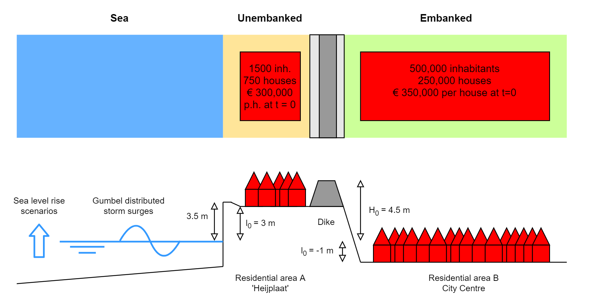
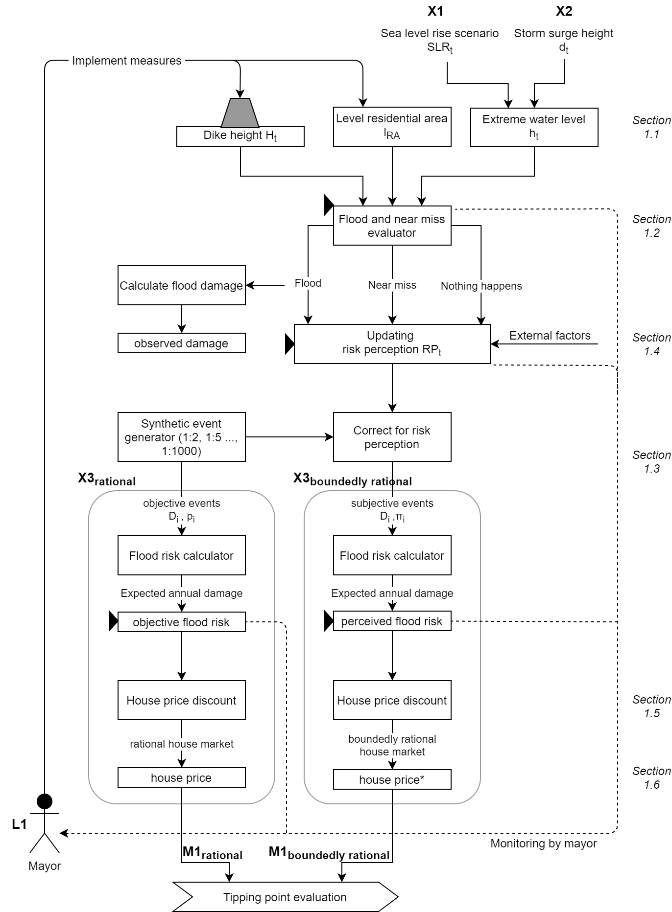
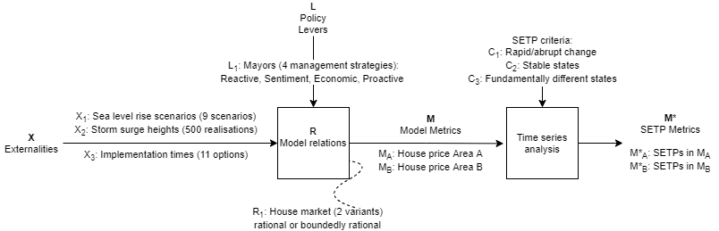

# Urban-SETP

This repository contains the model code and documentation for the paper Ginkel, Haasnoot & Botzen (2021, under review): "A framework for identifying climate change induced socio-economic tipping points".

The model is a dynamic adaptive, stylized simulation of flood risk and house prices of an archetypical coastal city, under many possible futures and dynamic adaptive flood protection strategies. It is meant to illustrate the identification of tipping points from a large number of experiments, not for detailed forecasting of the actual system state.

The main uncertainties are:
 - Sea level rise scenarios
 - Storm surge scenarios
 - The flood protection strategy (reflected by a 'mayor')
 - The time it takes to implement flood protection measures
 - The behaviour of the housing market in response to the flood risk
 
This repository contains both:
 - The code to do single (or a few) model runs, while setting the above uncertainties to selected fixed values
 - The code to run many (order 100,000) experiments, and explore under what conditions tipping points occur

When using this model, please include a reference to the article and a link to this Github repository.

For any questions or feedback, do not hesitate to contact me! 

# Quick tour and key results
Here, we take you through the basic model set-up..

## The model
The [Rotty model](models.py) describes a coastal city, threatened by storm surges from the sea which are aggravated by sea level rise. Residential area A is an outer-dike area with an elevation well above sea level. Residential area B is located in a polder below sea level, but is protected by a dike. 

Each [model run](run_model.py) simulates the development of the flood risk over time for the residential areas of the city, for a variety of sea level rise and storm surge scenarios.  Four different [management strategies (mayors)](mayors.py) can be chosen to adapt components of the city or the flood protection over time. Each mayor reflects an archetypical, different approach to flood risk management.
The model runs on a yearly timestep, from 2020 to 2300. In each timestep t, [the following steps are taken](run_model.py):
 - The degree of sea level rise is drawn from the [SLR scenario](SLR_projections), and a [storm surge height series](SurgeHeight) is selected
 - The water levels are compared to the flood protection levels, resulting in either ‘nothing happens’, a ‘near-miss wake-up call’ or a ‘flood’.  When the dikes are overtopped the resulting flood depths are calculated. Failure due to fragility of the dikes is not considered here
 - A (objective) flood risk assessment for the sea level and storm surge conditions is carried out to calculate the annual expected damage for the climatic conditions in the timestep. This accounts for the SLR and adaptation that already took place until that timestep, but not for future SLR or adaptation 
 - The recent experiences with floods (including near-misses) per residential area feed into the risk perception module, which calculates the development of the perceived or subjective flood risk as a function of the objective flood risk 
 - Both the objective and subjective flood risk are discounted in the house price using hedonistic price theory
 - The mayor of the city evaluates the above state parameters and decides on the implementation of new measures to manage the flood risk of the city 
 - When their implementation time has expired, the measures contribute to the flood protection of the city.

[Notebook 00](00_Rotty_compare_SLR_per_Mayor.ipynb) shows the model behaviour for illustrative mayors and flood protection strategies.  
[Notebook 02](02_Rotty_compare_imptimes.ipynb) shows the model behaviour for different implementation times.  
[Notebook 03](03_Rotty_compare_transients.ipynb) shows the model behaviour for different storm surge scenarios.  

## Tipping point identification
The objective of the model is to show how climate change induced socio-economic tipping points can be identified. A socio-economic tipping points is defined as: "a climate change induced, abrupt change of a socio-economic system, into a new, fundamentally different state (beyond a certain threshold that stakeholders perceive as critical).", after [Van Ginkel et al., 2020](https://iopscience.iop.org/article/10.1088/1748-9326/ab6395).

For this purpose, the [model is run many times](30_EMA_Workbench_run.ipynb), with the help of the [EMA Workbench](https://github.com/quaquel/EMAworkbench). After each experiment, an algorithm is run to detect tipping points in the metrics (house prices(t)).

The results of the many experiments can explored with different techniques. 
[Notebook 31](31_EMA_FeatureScoring.ipynb) Shows the results of Feature Scoring  
[Notebook 32](32_EMA_Scenario_discovery.ipynb) Shows the results of Scenario Discovery  
[Notebook 33](33_EMA_Dimstack.ipynb) Shows the results of Dimensional Stacking  

# The code
The code is mainly object-oriented, so it can be easily adapted for other cities and adaptation strategies. On a normal pc, an experiment should run within a few seconds.

## Building a basic model
[classes.py](classes.py) defines the generic model classes and functions. Some important classes are: 
 - Model() - which contains the building blocks of each city, 
 - ResidentialArea() - the neighbourhoods of the city
 - FloodProtection() - objects protecting the residential areas (such as dikes)
 - SLR_Scenario(), SurgeHeight(), and the sum of both: SurgeLevel()
 - Mayors(ABC) - defines the flood protection strategy
 - Measure() - how the model can be altered by a mayor

 - Experiment() - a unique combination of a model, mayor, SLR & surge height scenario

[models.py](models.py) describes the city, by setting properties of the residential areas, and the flood protection objects protecting them, and other city-specific parameters

[mayors.py](mayors.py) defines how and under what conditions mayors intervene in the system

[run_model.py](run_model.py) describes the protocol for adapting the model in each timestep of an experiment

[001_runtest_Rotty.py](001_runtest_Rotty.py) is a simple model runtest without Jupyter Notebooks.

## Tipping point identification
[tipping.py](tipping.py) contains specific classes and functions to identify tipping points within a metric timeseries (in this case: house prices)

[210_run_TP_identification.py](210_run_TP_identification.py) shows how the tipping point algorithm can be run. 

[21_TippingPoint_ident_manyEXP.ipynb](21_TippingPoint_ident_manyEXP.ipynb) provides a more visual approach.

## Many experiments
[workbench_version](workbench_version) shows how the model can be run with the EMA-Workbench. This not only defines the model as one function, but also initialises the tipping point identification algorithm.

[30_EMA_Workbench_run.ipynb](30_EMA_Workbench_run.ipynb) Coordinates working with the Workbench, exploration of the results is done in the other Notebooks (3X)

 

